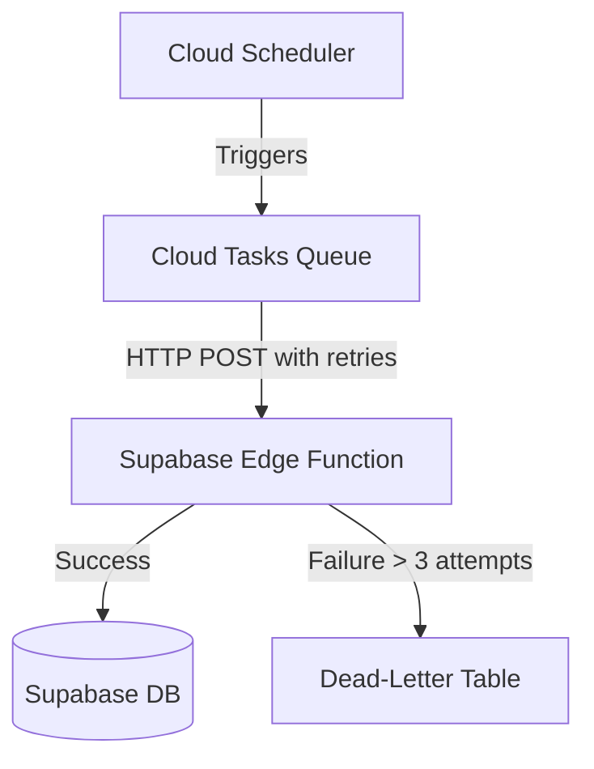

# Part 7: Observability and Failure Handling

This document details the observability, reliability, and failure-handling strategies for SkillBridge Pro. It ensures that the system is resilient, observable, and capable of gracefully handling errors, allowing the small student-founder team to maintain and troubleshoot the application efficiently.

## 1. Structured Logging Strategy

To monitor system health and trace requests across boundaries, we will implement structured JSON logging using **Pino** or **Winston** on the backend. 

### 1.1 Context Injection
Every incoming API request or webhook will be assigned a unique `requestId`. Where authenticated, the `userId` will also be injected into the log context.

```typescript
// Example: Express/Fastify Middleware for context injection
import { v4 as uuidv4 } from 'uuid';
import pino from 'pino';

const logger = pino();

export const loggingMiddleware = (req, res, next) => {
  req.requestId = req.headers['x-request-id'] || uuidv4();
  req.logger = logger.child({
    requestId: req.requestId,
    userId: req.user?.id || 'unauthenticated',
    path: req.path,
    method: req.method
  });
  
  req.logger.info('Request started');
  next();
};
```

### 1.2 Specialized Log Categories
- **Agent Event Logs**: Log inputs, prompt versions, and outputs of Gemini AI invocations. Critical for debugging AI hallucinations or unexpected formatting.
- **Payment Webhook Logs**: Every Razorpay webhook must be logged immediately upon receipt before signature validation, after validation, and upon successful processing to ensure no payment events are lost.
- **Job Logs**: Background jobs (Google Cloud Scheduler/Tasks) will log their `jobId`, `attempt`, and outcome.

## 2. Frontend Observability & Error Boundaries

### 2.1 React Error Boundaries
The React frontend will utilize Error Boundaries to prevent full application crashes and display fallback UI when a component fails.

```tsx
import React from 'react';
import { ErrorBoundary } from 'react-error-boundary';

function FallbackUI({ error, resetErrorBoundary }) {
  return (
    <div className="error-container p-4 bg-red-50 border border-red-200 rounded">
      <h2 className="text-red-700">Something went wrong</h2>
      <pre className="text-sm text-red-500">{error.message}</pre>
      <button onClick={resetErrorBoundary} className="btn-primary mt-2">Try again</button>
    </div>
  );
}

// Usage in App.tsx or route level
<ErrorBoundary FallbackComponent={FallbackUI} onError={logErrorToService}>
  <DashboardComponent />
</ErrorBoundary>
```

### 2.2 API Error Tracking
All frontend API calls via `fetch` or Axios will be wrapped in an interceptor that logs failing requests to a centralized tracker (e.g., Sentry) with network context.

## 3. Backend Health & Resilience

### 3.1 Cloud Run Health Endpoint
Google Cloud Run requires health checks for load balancing and continuous deployment verification.

```typescript
// Healthcheck Endpoint
app.get('/health', (req, res) => {
  res.status(200).json({
    status: 'UP',
    timestamp: new Date().toISOString(),
    version: process.env.npm_package_version || '1.0.0',
    // Optionally include lightweight DB ping
  });
});
```

### 3.2 Retry Policy & Exponential Backoff
For external API calls (Gemini AI, Razorpay, Supabase Edge Functions), we will implement an exponential backoff retry mechanism. 

```typescript
import axios from 'axios';
import axiosRetry from 'axios-retry';

const client = axios.create({ timeout: 10000 }); // 10s default timeout

axiosRetry(client, { 
  retries: 3, 
  retryDelay: axiosRetry.exponentialDelay,
  retryCondition: (error) => {
    // Retry on 5xx errors or network timeouts
    return axiosRetry.isNetworkOrIdempotentRequestError(error) || error.response?.status >= 500;
  }
});
```

### 3.3 Timeout Settings
- **Frontend requests**: 15 seconds.
- **Gemini API calls**: 25 seconds (AI generation can be slow).
- **Razorpay APIs**: 5 seconds.
- **Database queries**: 10 seconds statement timeout on PostgreSQL.

## 4. Background Jobs & Dead-Letter Handling

### 4.1 Architecture
Background tasks (like end-of-day XP calculations or automated diagnostic generation) will use Cloud Tasks, triggering Supabase Edge Functions.



### 4.2 Dead-Letter Queue (DLQ)
When a job repeatedly fails beyond the max retry limit, it will be stored in a `failed_jobs` table in Supabase.

```sql
CREATE TABLE failed_jobs (
    id UUID PRIMARY KEY DEFAULT gen_random_uuid(),
    job_name TEXT NOT NULL,
    payload JSONB NOT NULL,
    error_message TEXT,
    failed_at TIMESTAMPTZ DEFAULT NOW(),
    resolved BOOLEAN DEFAULT FALSE
);

-- RLS: Only accessible by admins
ALTER TABLE failed_jobs ENABLE ROW LEVEL SECURITY;
CREATE POLICY "Admins can view failed jobs" ON failed_jobs FOR SELECT USING (is_admin(auth.uid()));
```

## 5. Admin Dashboard Requirements

A simple, secure internal dashboard (accessible only to users with the `admin` role) will be implemented to monitor system health:
1. **Failed Jobs View**: List items from the `failed_jobs` table with a "Retry" button (which re-enqueues the payload).
2. **Agent Errors View**: List recent Gemini API failures (timeout, content filter blocks, schema validation errors).
3. **Webhook Discrepancies**: Flags payments recorded by Razorpay but not fulfilled in the DB.

## 6. SLO-Style Targets

To maintain a high quality of service as we scale from 100 to 10,000+ users, the team will monitor the following Service Level Objectives (SLOs):

| Metric | Target | Measurement Strategy |
|--------|--------|----------------------|
| **API Success Rate** | 99.9% | Percentage of HTTP 2xx and 4xx (client error) vs 5xx (server error) responses. |
| **Diagnostic Generation Success Rate** | 99.5% | Track successful Gemini structured output generations without fallback or failure. |
| **Booking Confirmation Success Rate** | 99.99% | Track mentor booking finalizations without double-booking or database conflicts. |
| **Payment Webhook Processing** | 99.99% | Monitor Razorpay webhook delivery success rate. |
| **AI Response Latency** | < 4s (p95) | Measure time from backend receiving request to Gemini returning fully parsed response. |
| **Queue Processing Time** | < 5s (p95) | Time a job spends in queue before execution starts. |
