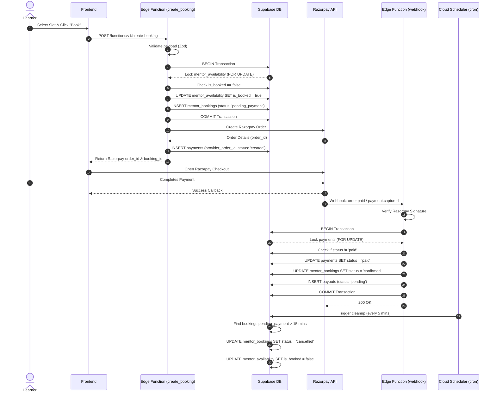

# Booking, Payments, and Consistency Design

This document outlines the transaction flow, SQL strategies, race-condition prevention, and webhook idempotency for the SkillBridge Pro mentor booking and payment system.

## 1. Sequence Diagram



## 2. SQL Transaction Strategy

To safely handle the booking state machine, we use row-level locking (`SELECT ... FOR UPDATE`) to prevent concurrent modifications.

### A. Reserving the Slot
We do not make external HTTP calls (to Razorpay) while holding a database lock. The slot is reserved first.

```sql
BEGIN;
-- 1. Lock the availability row
SELECT * FROM mentor_availability 
WHERE id = $1 AND is_booked = false 
FOR UPDATE;

-- (If no row is returned, the slot is already booked or invalid. ROLLBACK and return error.)

-- 2. Mark as booked to prevent others from claiming it
UPDATE mentor_availability 
SET is_booked = true 
WHERE id = $1;

-- 3. Create the booking record
INSERT INTO mentor_bookings (learner_id, mentor_id, scheduled_at, status)
VALUES ($2, $3, $4, 'pending_payment')
RETURNING id;
COMMIT;
```
*After this transaction commits, the Edge Function creates the Razorpay Order and inserts the corresponding row into the `payments` table.*

### B. Processing the Webhook
```sql
BEGIN;
-- 1. Lock the payment row
SELECT * FROM payments 
WHERE provider_order_id = $1 
FOR UPDATE;

-- (If status is already 'paid', we COMMIT immediately - idempotency handled)

-- 2. Update payment status
UPDATE payments SET status = 'paid' WHERE provider_order_id = $1;

-- 3. Update booking status
UPDATE mentor_bookings 
SET status = 'confirmed' 
WHERE id = $2;

-- 4. Generate the Payout record
INSERT INTO payouts (mentor_id, booking_id, status, ...)
VALUES ($3, $2, 'pending', ...);
COMMIT;
```

### C. Background Cleanup (Cron)
Releasing abandoned checkout sessions.

```sql
BEGIN;
-- Find expired pending bookings
WITH expired_bookings AS (
    SELECT id, scheduled_at -- Needs join to get availability id if applicable
    FROM mentor_bookings
    WHERE status = 'pending_payment'
      AND created_at < NOW() - INTERVAL '15 minutes'
    FOR UPDATE SKIP LOCKED
)
-- Update bookings
UPDATE mentor_bookings
SET status = 'cancelled'
WHERE id IN (SELECT id FROM expired_bookings);

-- Free up slots
UPDATE mentor_availability
SET is_booked = false
WHERE ... -- matches the expired bookings
COMMIT;
```

## 3. Race-Condition Prevention Plan

1. **Double Booking Prevention:**
   - Handled via `SELECT ... FOR UPDATE` on `mentor_availability`. If two users click "Book" on the exact same slot at the exact same millisecond, the database serializes the transactions. The first one acquires the lock, sets `is_booked = true`, and commits. The second one reads `is_booked = true` and fails cleanly.
   
2. **Network I/O Outside Transactions:**
   - Creating the Razorpay order involves a network call to Razorpay. If this was inside the `BEGIN...COMMIT` block, any latency from Razorpay would keep the row locked, degrading database throughput. Thus, we reserve the slot *first*, commit, and *then* call Razorpay.

3. **Payment Failure / Abandonment Race:**
   - If a user closes the tab before paying, the slot remains locked (`pending_payment`). The Cloud Scheduler cron job acts as a safety net, scanning for stale `pending_payment` bookings older than 15 minutes and safely unlocking them (`is_booked = false`).
   - `SKIP LOCKED` is used in the cleanup job so if a webhook is concurrently updating a payment, the cleanup job skips it and doesn't block.

## 4. Webhook Idempotency Plan

Payment providers like Razorpay guarantee "at least once" delivery for webhooks, meaning the same webhook might hit our Edge Function multiple times. 

1. **Signature Verification:**
   - Every webhook payload is strictly validated using `crypto.verify` against the Razorpay `x-razorpay-signature` header and our backend webhook secret. This prevents spoofing.
   
2. **State-Machine Idempotency:**
   - Instead of blindly updating records, the webhook transaction first checks the *current state* of the `payments` row using `FOR UPDATE`.
   - If the payment is already marked as `paid`, the function returns `200 OK` without making further changes or creating duplicate `payouts` records.
   
3. **Audit Logging:**
   - Every webhook event (including duplicates) is logged into `admin_audit_logs` (or a dedicated `webhook_events` table) with the Razorpay event ID (`x-razorpay-event-id`). This guarantees we can trace exactly when a payment was processed and by which payload.

## 5. Refund and Dispute State Machine

- **Completion:** After a session happens, the mentor marks it "completed". A cron job or Edge function transitions the `payouts` record from `pending` to `eligible` after a 24-48 hour cooling-off period.
- **Dispute:** If a learner opens a dispute within the cooling-off period, the booking status becomes `disputed`, and the payout status is frozen at `pending`. An admin reviews it.
- **Resolution:**
  - If admin rules in favor of learner: Razorpay refund API is called. Webhook (`refund.processed`) updates `payments` to `refunded`, `mentor_bookings` to `refunded`, and `payouts` to `failed`.
  - If admin rules in favor of mentor: `mentor_bookings` becomes `completed`, `payouts` becomes `eligible`.
